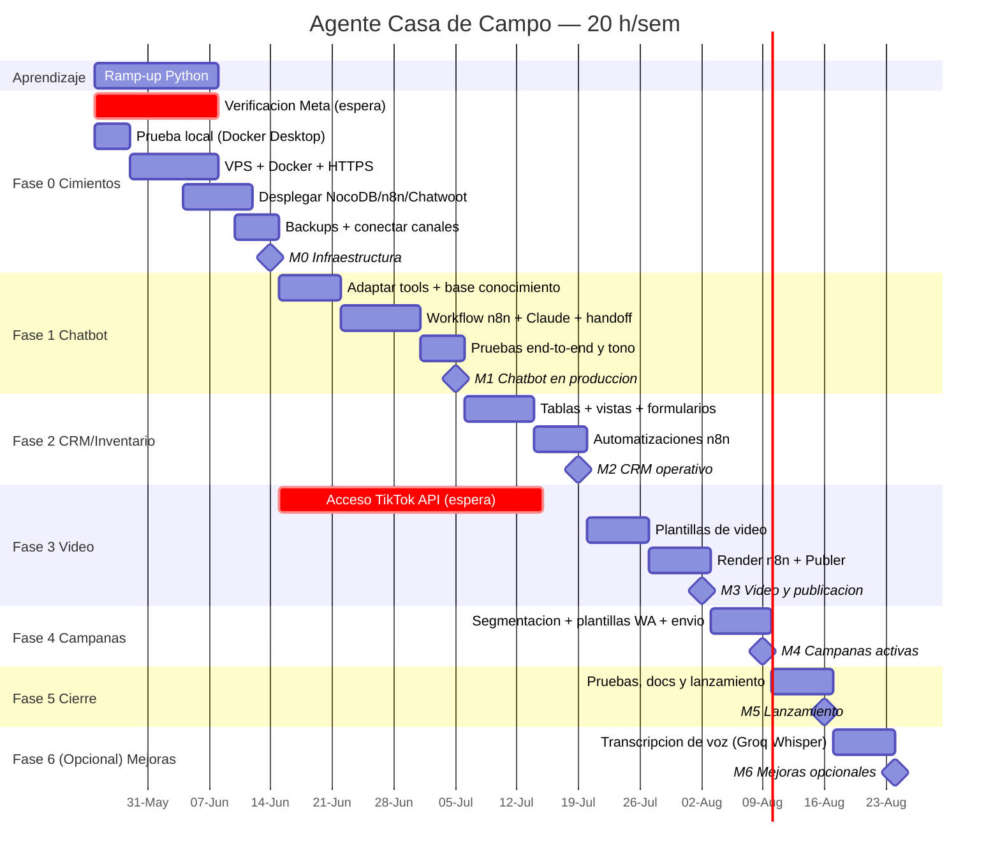

# Plan de Proyecto — Agente Casa de Campo

> **Plan vivo / tracker.** El avance se recalcula con `python tools/progress.py`
> (o automáticamente en cada `git commit` gracias al hook). Marca las tareas con `- [x]`
> a medida que las completas.

## Resumen
- **Ejecutor:** 1 persona (ingeniero electrónico; C/Java + MySQL; aprendiendo Python).
- **Dedicación:** 20 h/semana.
- **Inicio:** 2026-05-25 · **Lanzamiento objetivo:** 2026-08-16 (~12 semanas, ~219 h core + 8 h opcionales en Fase 6).
- **Presupuesto:** ~$70/mes en herramientas.
- **Repo:** github.com/kocheluis/Casa-de-campo-agente (privado).

## Modo de trabajo
- **Probar en local antes del VPS:** todo el stack (Chatwoot + n8n + NocoDB) se valida
  primero en **Docker Desktop** (PC), y solo cuando funciona se replica al VPS. Esto
  reduce el riesgo de fallar en producción al primer intento. Archivos:
  `deploy/docker-compose.local.yml` (modo local) y `deploy/README.md` (sección de prueba
  local). Lo único que no se prueba en local son los webhooks de Meta (se usa un túnel
  temporal o ya el VPS).
- **El diseño de datos** está en `docs/modelo-datos.md` (tablas, tipos y relaciones).

## Avance actual
<!-- PROGRESS:START -->
**Última actualización:** 2026-05-29 12:04

**Avance global: 18%**  `####----------------`  (40/227 h)

| Fase | Avance | Tareas | Horas |
|---|---|---|---|
| Ramp-up Python | 100% `############` | 3/3 | 15/15 |
| Fase 0 — Cimientos | 10% `#-----------` | 1/9 | 6/58 |
| Fase 1 — Chatbot multicanal | 25% `###---------` | 2/6 | 13/52 |
| Fase 2 — CRM + Calendario + Inventario | 21% `###---------` | 1/4 | 6/28 |
| Fase 3 — Generación y publicación de video | 0% `------------` | 0/4 | 0/33 |
| Fase 4 — Campañas con la base de clientes | 0% `------------` | 0/3 | 0/18 |
| Fase 5 — Cierre y lanzamiento | 0% `------------` | 0/3 | 0/15 |
| Fase 6 — Mejoras opcionales post-lanzamiento | 0% `------------` | 0/1 | 0/8 |
<!-- PROGRESS:END -->

## Milestones

| Milestone | Entregable | Fecha objetivo | Estado |
|---|---|---|---|
| **M0** | Infraestructura lista (fin Fase 0) | 2026-06-14 | ⬜ Pendiente |
| **M1** | Chatbot multicanal en producción (fin Fase 1) | 2026-07-05 | ⬜ Pendiente |
| **M2** | CRM + Calendario + Inventario operativo (fin Fase 2) | 2026-07-19 | ⬜ Pendiente |
| **M3** | Generación y publicación de video (fin Fase 3) | 2026-08-02 | ⬜ Pendiente |
| **M4** | Campañas activas (fin Fase 4) | 2026-08-09 | ⬜ Pendiente |
| **M5** | Lanzamiento final + documentación (fin Fase 5) | 2026-08-16 | ⬜ Pendiente |
| **M6** | *(Opcional)* Mejoras post-lanzamiento — transcripción de voz | 2026-08-24 | ⬜ Pendiente |

## Cronograma (Gantt)

## Desglose de tareas

> Las horas entre paréntesis `(Nh)` ponderan el avance. No borres los marcadores
> `TASKS:START/END` ni los encabezados `### Fase` (el script los usa para calcular).

<!-- TASKS:START -->
### Ramp-up Python
- [X] Fundamentos de Python: sintaxis vs C/Java, tipos, listas y diccionarios (6h)
- [X] Entorno: venv, pip, ejecutar scripts, `requirements.txt` (3h)
- [X] Librería `requests` + leer y entender los tools del proyecto (6h)

### Fase 0 — Cimientos
- [ ] Iniciar verificación de Meta Business con el RUC (correr en segundo plano) (8h)
- [x] Instalar Docker Desktop y probar el stack completo en local antes del VPS (6h)
- [ ] Contratar VPS (8 GB) + instalar Docker + firewall (8h)
- [ ] Dominio + 3 subdominios + HTTPS (Caddy/Nginx Proxy Manager) (6h)
- [ ] Desplegar NocoDB + PostgreSQL (6h)
- [ ] Desplegar n8n (6h)
- [ ] Desplegar Chatwoot (8h)
- [ ] Conectar canales WhatsApp/IG/FB en Chatwoot (6h)
- [ ] Configurar backups automáticos del PostgreSQL (4h)

### Fase 1 — Chatbot multicanal
- [x] Repasar y adaptar tools WAT (ai_reply, db_client, meta_send) (10h)
- [ ] Llenar la base de conocimiento con datos reales del dueño (6h)
- [x] Crear cuenta de la API de Anthropic + API key + prueba en vivo del cerebro (3h)
- [ ] Workflow n8n: Chatwoot -> n8n -> Claude -> Chatwoot (15h)
- [ ] Captura de lead + pre-reserva + lógica de handoff en NocoDB (10h)
- [ ] Pruebas end-to-end y ajuste de tono (8h)

### Fase 2 — CRM + Calendario + Inventario
- [x] Modelar tablas en NocoDB (Clientes, Reservas, Inventario, Conversaciones) (6h)
- [ ] Vistas Calendario/Grid + Dashboard del dueño (8h)
- [ ] Formulario de inventario (móvil/PWA) + vista faltante/averiado (6h)
- [ ] Automatizaciones n8n (recordatorios de check-in / averías) (8h)

### Fase 3 — Generación y publicación de video
- [ ] Solicitar acceso a la TikTok Content Posting API (iniciar temprano) (3h)
- [ ] Diseñar 2-3 plantillas de video (JSON2Video/Creatomate) (12h)
- [ ] Flujo de render en n8n + tools/video_pipeline.py (12h)
- [ ] Configurar Publer + programación a IG/FB/TikTok (6h)

### Fase 4 — Campañas con la base de clientes
- [ ] Segmentar clientes en NocoDB por etiquetas/origen (4h)
- [ ] Crear y aprobar plantillas de WhatsApp en Meta (6h)
- [ ] tools/send_campaign.py + medición de respuestas (8h)

### Fase 5 — Cierre y lanzamiento
- [ ] Pruebas integrales y corrección de bugs (8h)
- [ ] Documentación de operación para el dueño (4h)
- [ ] Lanzamiento en producción y monitoreo inicial (3h)

### Fase 6 — Mejoras opcionales post-lanzamiento
- [ ] Transcripción de notas de voz entrantes con Groq Whisper API (gratis 25 h/día) (8h)
<!-- TASKS:END -->

## Registro de riesgos

| # | Riesgo | Prob. | Impacto | Mitigación |
|---|---|---|---|---|
| R1 | Verificación de Meta Business se retrasa | Media | Alto | Iniciar el día 1; usar el número de prueba de Meta mientras tanto |
| R2 | Aprobación de TikTok API tarda 2-6 semanas | Alta | Medio | Solicitar al inicio (Fase 0); no bloquea otras fases; publicar manual entretanto |
| R3 | Curva de Python más lenta de lo previsto | Media | Medio | Ramp-up dedicado + apoyo del asistente; empezar por scripts simples (progress.py) |
| R4 | Fricción IG/Messenger en n8n (mensajes que no se devuelven) | Media | Medio | Plan B: ManyChat solo como pasarela de IG hacia n8n |
| R5 | NocoDB: bugs / pérdida de datos | Media | Alto | Backups automáticos de PostgreSQL; operar vía formularios; plan B Airtable |
| R6 | VPS mal dimensionado (Chatwoot pesado) | Baja | Alto | Contratar 8 GB RAM desde el inicio |
| R7 | Presupuesto se excede al pagar API de video | Media | Medio | Mantener video en plan gratis; faseado; no pagar video+clips+programador a la vez |
| R8 | Ventana de 24 h de WhatsApp limita reactivar conversaciones | Media | Bajo | Plantillas pre-aprobadas desde Fase 1 |
| R9 | Trabajar solo: imprevisto/enfermedad detiene todo | Media | Medio | Buffer semanal; commits frecuentes a GitHub; todo documentado |

## Cómo usar este plan como tracker

1. **Marca tareas hechas:** cambia `- [ ]` por `- [x]` en el desglose de arriba.
2. **Recalcula el avance:** corre `python tools/progress.py` → reescribe "Avance actual"
   con el % por fase y global, y la fecha de actualización.
3. **Automático en cada commit:** hay un hook `pre-commit` instalado que corre el script
   solo cuando haces `git commit`, así el avance siempre queda al día en GitHub.
4. **Milestones:** al cerrar una fase, cambia su estado en la tabla de Milestones a
   ✅ y, si quieres, marca el hito en el Gantt.
