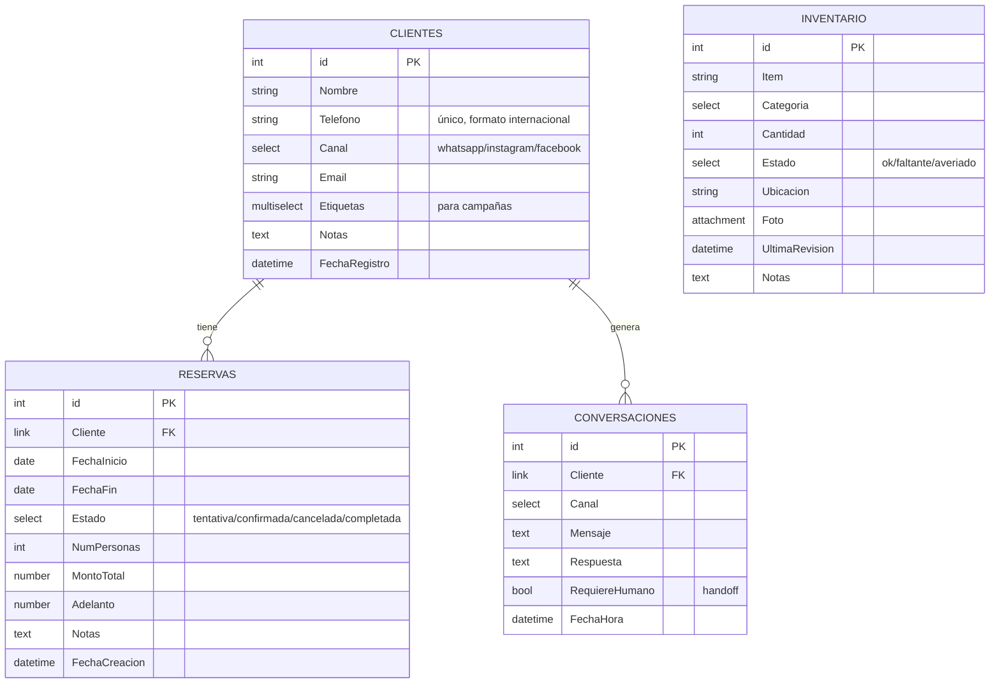

# Modelo de datos (NocoDB)

> Diseño de las tablas del negocio. NocoDB funciona como una capa visual sobre una base
> relacional, así que esto te será muy familiar viniendo de **MySQL**. Aquí está el
> esquema que crearás en NocoDB en la Fase 2 (y que ya usan los `tools/`).

## Equivalencias NocoDB ↔ MySQL (para ubicarte)

| En NocoDB | En MySQL |
|---|---|
| Base / Tabla | Schema / Tabla |
| Field (campo) | Columna |
| Tipo **SingleSelect** | `ENUM(...)` |
| Tipo **Link / LinkToAnotherRecord** | `FOREIGN KEY` (relación) |
| Tipo **Attachment** | archivo (ruta/BLOB) |
| **Lookup / Rollup** | columna calculada vía `JOIN` |
| Vista (Grid/Calendar/Form) | `VIEW` + interfaz |

## Diagrama de relaciones

## Tablas en detalle

### 1. `Clientes` — CRM y base para campañas
| Campo | Tipo NocoDB | Notas |
|---|---|---|
| Nombre | SingleLineText | |
| Telefono | PhoneNumber / SingleLineText | **clave de negocio**, único, formato `51999...` |
| Canal | SingleSelect | whatsapp · instagram · facebook · otro (origen del lead) |
| Email | Email | opcional |
| Etiquetas | MultiSelect | interesado · cliente · VIP · … (para segmentar campañas) |
| Notas | LongText | |
| FechaRegistro | CreatedTime | automático |
| Reservas | Link → Reservas | 1 cliente : N reservas |
| Conversaciones | Link → Conversaciones | 1 cliente : N conversaciones |

### 2. `Reservas` — calendario de separación
| Campo | Tipo NocoDB | Notas |
|---|---|---|
| Cliente | Link → Clientes | N reservas : 1 cliente |
| FechaInicio | Date | usado por la **vista Calendario** |
| FechaFin | Date | |
| Estado | SingleSelect | tentativa · confirmada · cancelada · completada |
| NumPersonas | Number | |
| MontoTotal | Currency/Number | |
| Adelanto | Currency/Number | lo que se pagó para separar |
| Notas | LongText | |
| FechaCreacion | CreatedTime | automático |

### 3. `Inventario` — control de la casa
| Campo | Tipo NocoDB | Notas |
|---|---|---|
| Item | SingleLineText | |
| Categoria | SingleSelect | cocina · dormitorio · baño · exterior · limpieza · otro |
| Cantidad | Number | |
| Estado | SingleSelect | ok · faltante · averiado (filtro clave para reposición) |
| Ubicacion | SingleLineText / SingleSelect | |
| Foto | Attachment | foto del ítem / del daño |
| UltimaRevision | LastModifiedTime | automático |
| Notas | LongText | |

### 4. `Conversaciones` — registro del chatbot
| Campo | Tipo NocoDB | Notas |
|---|---|---|
| Cliente | Link → Clientes | N conversaciones : 1 cliente |
| Canal | SingleSelect | whatsapp · instagram · facebook |
| Mensaje | LongText | lo que escribió el cliente |
| Respuesta | LongText | lo que respondió el bot |
| RequiereHumano | Checkbox | `true` = handoff (el dueño debe intervenir) |
| FechaHora | CreatedTime | automático |

## Vistas a crear (en la Fase 2)
- **Reservas → Calendario:** sobre `FechaInicio`. Es el "calendario de separación".
- **Reservas → Grid** filtrado por `Estado = tentativa` (para confirmar pendientes).
- **Inventario → Grid** filtrado por `Estado != ok` ("Faltante / Averiado").
- **Inventario → Formulario:** URL compartible para actualizar desde el móvil (Android).
- **Clientes → Grid** con filtros por `Etiquetas` (para armar campañas).

## Nota sobre el código actual
Los `tools/` (ej. `db_client.py`) hoy escriben el campo **`Telefono`** directo en
`Reservas` y `Conversaciones` por simplicidad. Al implementar el modelo relacional en
NocoDB usaremos el campo **Link `Cliente`** (más correcto, como una `FOREIGN KEY`).
Es un ajuste menor que haremos en la Fase 1/2 cuando conectemos el código a NocoDB real.
